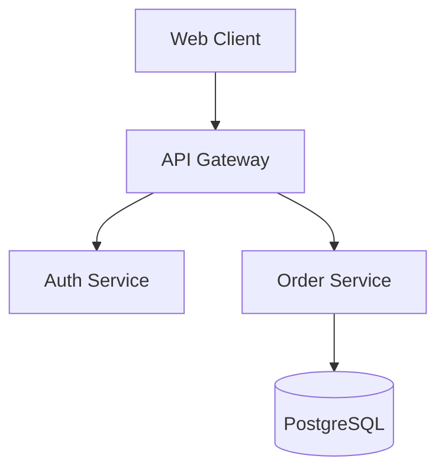

# pr-overlay

> **Rich Architecture & Verification review overlay for GitHub Pull Requests.**  
> Built for reviewing AI-agent-generated code with Mermaid diagrams, CLI terminal logs, animated GIFs, and anchored review comments.

---

## The Problem

AI coding agents can generate dozens of files and complex logic in seconds. However, reviewing AI-generated code directly in GitHub's standard "Files changed" diff is mentally draining:
- **No Architectural Context**: It is difficult to assess whether the agent made good structural and design choices.
- **Buried or Missing Verification**: Reviewers need visual proof (execution logs, animated GIFs, test results) that the code was actually validated.
- **Scattered Communication**: Feedback on design or test traces gets lost in long, unorganized PR comment threads.

`pr-overlay` enriches the GitHub PR UI with dedicated **Architecture** and **Verification** tabs, allowing reviewers to inspect and comment on high-level system designs and evidence directly within GitHub.

---

## How It Works

1. **AI Agent PR Protocol**: When an AI agent opens a PR, it writes the PR description containing designated sections for Architecture and Verification (using explicit comments or standard markdown headers), along with Mermaid diagrams, CLI logs, and uploaded media attachments.
2. **Userscript Detection**: The `pr-overlay` Tampermonkey script injects `[ Architecture ]` and `[ Verification ]` tabs directly into GitHub's PR navigation header.
3. **Rich In-Browser Rendering**:
   - **Mermaid.js Diagrams**: Renders interactive architecture flowcharts, sequence diagrams, and class diagrams directly in the browser with dark/light mode syncing.
   - **Terminal & CLI Log Viewer**: Renders command line outputs with exit code status badges (`Exit 0`), copy button, collapsible logs, and ANSI color support.
   - **Visual Evidence**: Renders screenshots, pictures, and animated GIFs uploaded to GitHub's CDN.
4. **Anchored Review Commenting**:
   - Reviewers can comment on any specific architecture block, diagram, or test log.
   - The userscript submits standard GitHub PR issue comments prepended with an anchor tag: `> [pr-overlay:architecture#data-flow]`.
   - Teammates without the script can read and reply to comments normally on GitHub's timeline.
   - For users with `pr-overlay`, comments appear anchored inline beneath the relevant diagram or log.

---

## AI Agent PR Specification

AI agents should format their PR descriptions using either explicit delimiters or standard markdown headers:

### Example PR Description Template

```markdown
<!-- pr-overlay:architecture:start -->
## Architecture

### System Design
Overview of how components interact and data flows through the new services.




<!-- pr-overlay:architecture:end -->

<!-- pr-overlay:verification:start -->
## Verification

### 1. Test Suite Execution
Demonstration of unit and end-to-end test execution:


### 2. Command Line & Log Output
```log [title="Unit & Integration Tests" command="npm test" exitCode="0"]
PASS test/pr-body-parser.test.mjs (1.2s)
PASS test/comment-parser.test.mjs (0.8s)
Test Suites: 2 passed, 2 total
Tests:       7 passed, 7 total
Snapshots:   0 total
Time:        2.145 s
```
<!-- pr-overlay:verification:end -->
```

---

## Installation

1. Install the [Tampermonkey extension](https://www.tampermonkey.net/) (or Violentmonkey / Greasemonkey) in Chrome, Firefox, Safari, or Edge.
2. Build the userscript locally or install `pr-overlay.user.js`:
   ```bash
   npm install
   npm run build
   ```
3. Open Tampermonkey dashboard -> **Utilities** -> **Install from file** and select `dist/pr-overlay.user.js` (or copy/paste the script).
4. Navigate to any GitHub Pull Request!

---

## Development

```bash
# Install dependencies
npm install

# Run Vite development server
npm run dev

# Run unit tests
npm test

# Build production userscript bundle
npm run build
```

---

## Repository Structure

- `src/`
  - `index.ts`: Userscript entry point, Turbo/PJAX hooks, and lifecycle management.
  - `types.ts`: TypeScript interfaces for parsed blocks, sections, and comments.
  - `parser/`
    - `pr-body-parser.ts`: Parses raw PR descriptions into architecture & verification blocks.
    - `comment-parser.ts`: Extracts anchor tags and groups comments by section.
  - `ui/`
    - `tabs.ts`: Injects and manages custom tabs in GitHub's header nav bar.
    - `container.ts`: Manages mounting view container and swapping with GitHub native buckets.
    - `theme.ts`: Detects and synchronizes with GitHub dark and light themes.
  - `renderers/`
    - `architecture-view.ts`: Renders architecture text, diagrams, and comment threads.
    - `verification-view.ts`: Renders verification evidence, logs, and media.
    - `mermaid-loader.ts`: Loads Mermaid.js dynamically and renders SVG charts.
    - `log-viewer.ts`: Formats terminal/CLI outputs with ANSI colors and status badges.
  - `comments/`
    - `comment-thread.ts`: Inline discussion thread component.
    - `github-api.ts`: Interacts with GitHub PR comments and submits comments using page session.
  - `styles/`
    - `overlay.css`: GitHub Primer CSS styled components.
- `test/`: Node.js test suite for parser logic.
