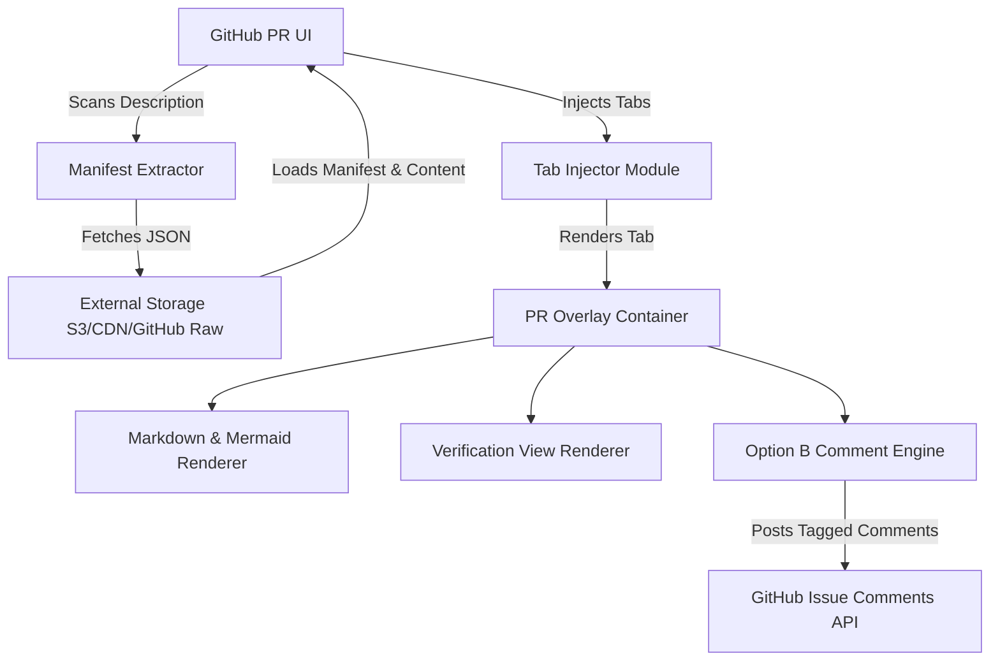
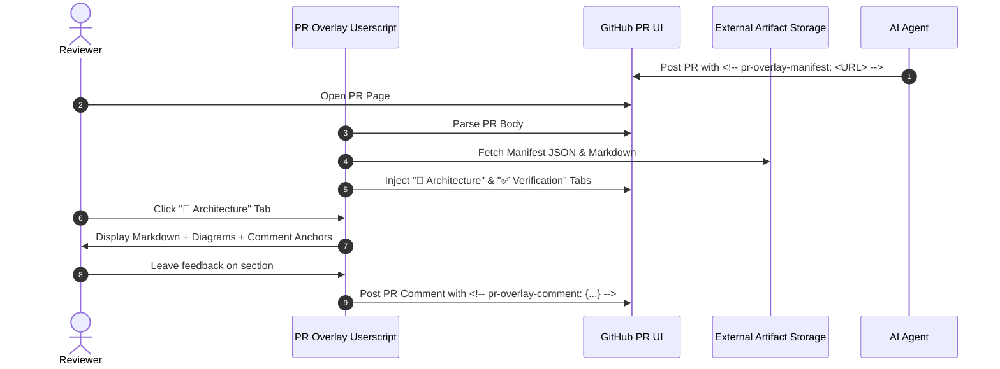

# System Architecture Overview

This pull request introduces the **PR Overlay Userscript**, which enriches the standard GitHub Pull Request interface with external verification results, architecture diagrams, and custom review tabs.

## High-Level Architecture Diagram

## Sequence Flow

## Key Modules

### 1. Tab Injector
Injects navigation tabs into GitHub's `nav[aria-label="Pull request"]` header bar, keeping native GitHub navigation intact when switching back to Conversation or Files Changed.

### 2. Option B Comment Sync Engine
Comments left on architecture sections or verification items post directly to standard GitHub PR issue comments containing encoded HTML comment metadata anchors (`<!-- pr-overlay-comment: {...} -->`).
